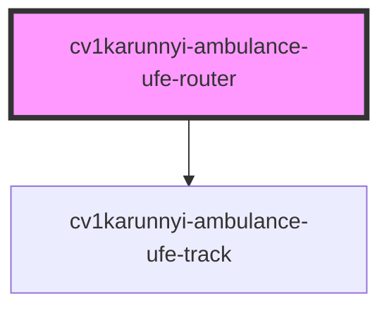

# cv1karunnyi-ambulance-ufe-router

<!-- Auto Generated Below -->

## Properties

| Property  | Attribute  | Description | Type     | Default                       |
| --------- | ---------- | ----------- | -------- | ----------------------------- |
| `apiBase` | `api-base` |             | `string` | `'http://localhost:5000/api'` |

## Dependencies

### Depends on

- [cv1karunnyi-ambulance-ufe-track](../cv1karunnyi-ambulance-ufe-track)

### Graph

----------------------------------------------

*Built with [StencilJS](https://stenciljs.com/)*
