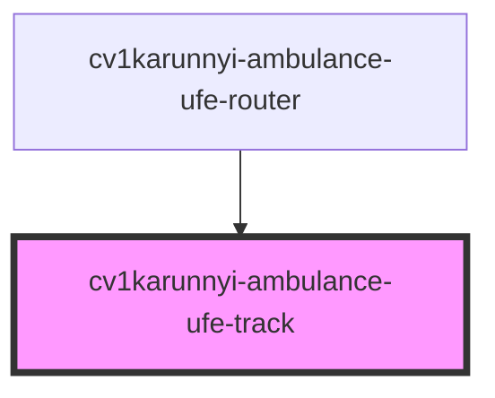

# cv1karunnyi-ambulance-ufe-track

<!-- Auto Generated Below -->

## Properties

| Property    | Attribute    | Description | Type                             | Default                       |
| ----------- | ------------ | ----------- | -------------------------------- | ----------------------------- |
| `apiBase`   | `api-base`   |             | `string`                         | `'http://localhost:5000/api'` |
| `patientId` | `patient-id` |             | `string`                         | `undefined`                   |
| `view`      | `view`       |             | `"create" \| "detail" \| "list"` | `'list'`                      |

## Events

| Event      | Description | Type                                                              |
| ---------- | ----------- | ----------------------------------------------------------------- |
| `navigate` |             | `CustomEvent<{ path: string; params?: Record<string, string>; }>` |

## Dependencies

### Used by

 - [cv1karunnyi-ambulance-ufe-router](../cv1karunnyi-ambulance-ufe-router)

### Graph

----------------------------------------------

*Built with [StencilJS](https://stenciljs.com/)*
